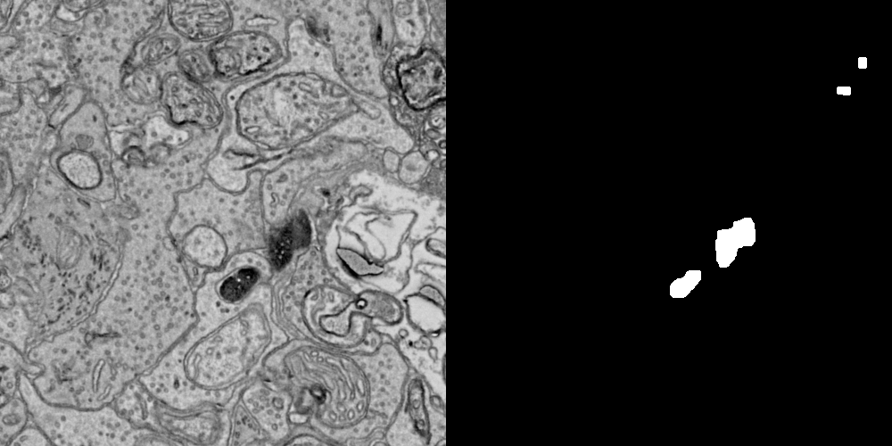
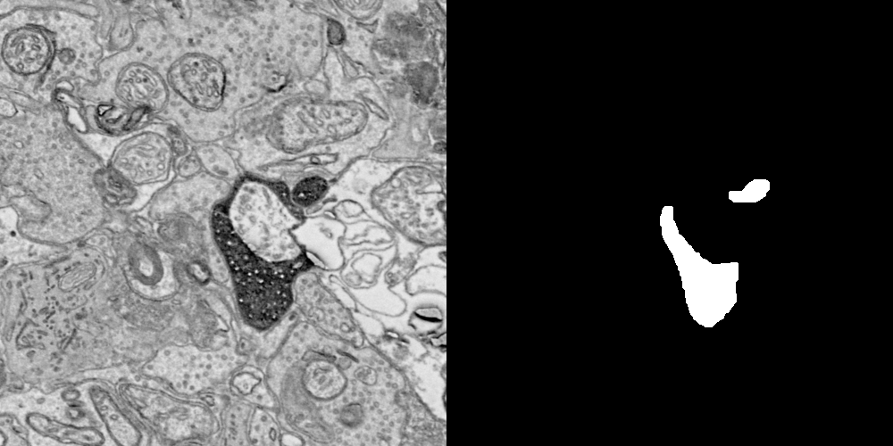

# Segmentation for Connectomics

## Project
For this project, our goal is to segment an APEX-labeled EM volume of retinal neurons. The original EM images are in the `images/` directory, and the ground-truth masks are in the `ground-truth/` directory. These masks show the pixels that belong to all APEX-labeled processes in an image. Note that some of the masks are only partially complete.     

Aftering examining the image and ground-truths dataset, I formulated the problem as finding the relatively darker pixels in an image, filtering out the noises, and smoothing the mask. Therefore, I decided to use the image processing toolkits from the OpenCV Python library. 

## Usage
- Make sure `numpy`, `opencv` and `matplotlib` libraries are installed    

- To view the **usage description**: `python3 segment.py`

- To **run** the program:    
    - `python segment.py all` process and **save** all images to `results/` folder  
    - `python segment.py {imageID}`  process and **display** a specified imageID    
 
## Evaluation
The evaulation method is qualitative matching to the ground-truth images; a few processed images are attached below.       
    
***From left to right: Original Image, Processed Image, Ground Truth***    

**ImageID 016:**    

    

**ImageID 025:**    

    

**ImageID 044:**    

    

   

## Sources
https://docs.opencv.org/2.4/doc/tutorials/imgproc/threshold/threshold.html
https://docs.opencv.org/trunk/d9/d61/tutorial_py_morphological_ops.html
https://docs.opencv.org/3.4/dc/dd3tutorial_gausian_median_blur_bilateral_filter.html
